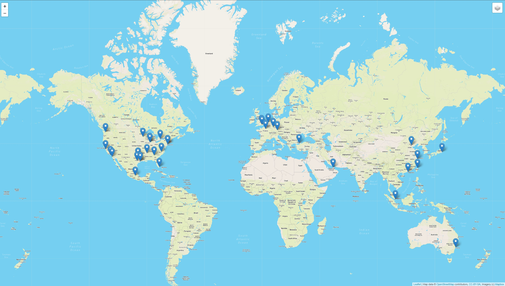
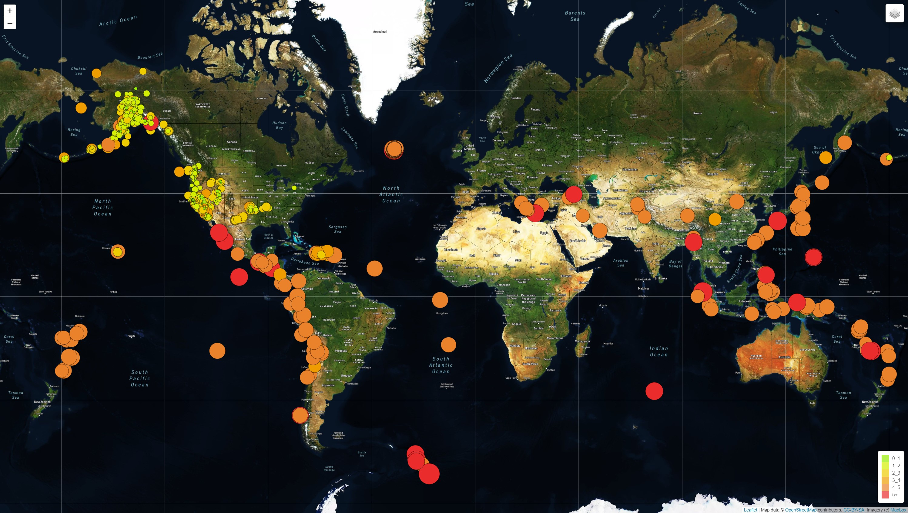
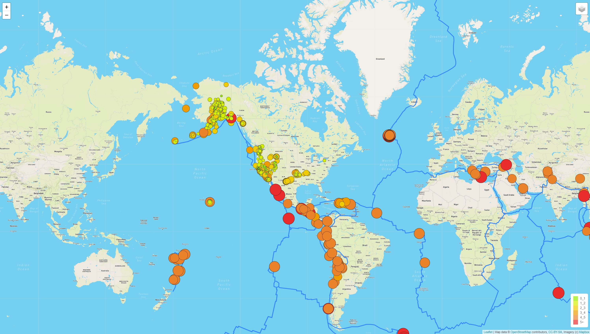

# Mapping_Earthquakes

# Description
Creating insightful data visualizations with interactive maps and features on earthquakes from around the world.

### Challenge Overview
Supporting websites and mobile application development use the latest earthquake GEOJSON 
data to traverse and retrieve the earthquake data by using JavaScript and the D3 and Leaflet
libraries and plot the data on a mapbox map through an Application Programming Interface (API) request.

On the map the magnitude and location of each earthquake will be shown in a pop-up marker. The diameter of the markers for each earthquake should reflect the magnitude of the earthquake in their size and color. Earthquakes with higher magnitude will appear larger and darker in color with a legend providing the context for the map data. 

Add an overlay to allow the user to toggle off and on the earthquake and tectonic data, and set the streets map as the default.

### Approach
*	Extracted GEoJSON data from https://github.com/fraxen/tectonicplates.
*	 Used Leaflet.js API to populate a geographical map with GeoJSON earthquake data from a URL.
*	 Made an API call to the tectonic plate data using d3.json().
*	Added the data using the L.geoJSON() layer.
*	Style the tectonic plate LineString data to stand out on the map.
*	Added the tectonic plate GeoJSON data as an overlay with the earthquake data to show relationship between the     location and frequency of earthquake activities and tectonic plates.
*	Added a third map style as an additional tile layer to allow the user to select from three different map styles.

### Results

* Simple Map - Multiple GeoJSON Points

* Map - Satellite Tectonic Plates
* Color coded earthquakes based on magnitude.
* Features magnitude and location popups and also a legend describing magnitude by intensity.

* Map - Streets Tectonic Plates

### Things I Learned
*	Creating, adding, committing, pushing and merging multiple branches from master branch on GitHub.
*	Retrieving data from a GeoJSON file.
*	Making API requests to a server.
*	Populating geographical maps using JavaScript and the Data-Driven Documents (D3) library.
*	Adding user interface controls via Leaflet.
*   Adding interactivity to maps using JavaSCript ES6.
*   Rendering maps on a local server.

### Software/Tools
JavaScript, Leaflet.js Application Programming Interface (API), URL, D3 Library